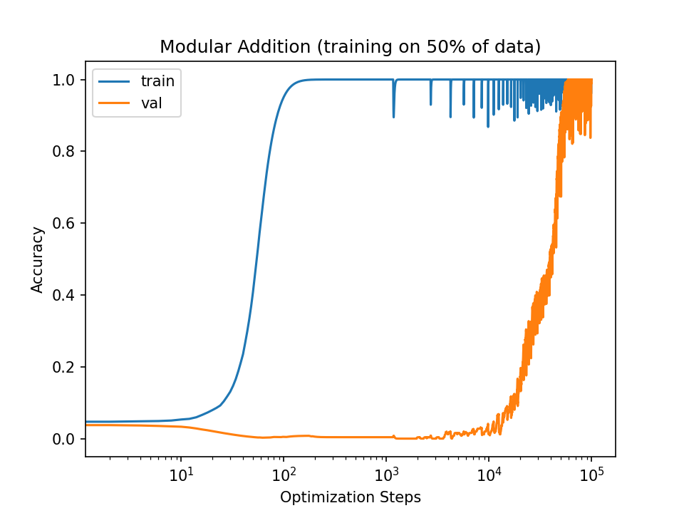
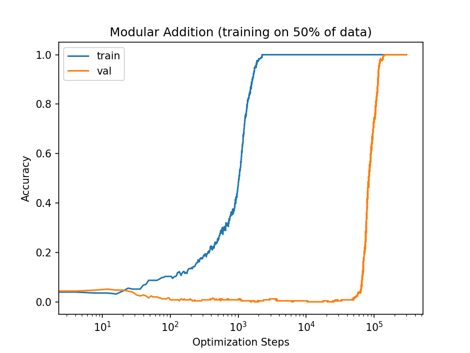

# grokking_for_various_models

This is the final preoject of ML course. We reproduce some reults in 
[Grokking: Generalization Beyond Overfitting on Small
Algorithmic
Datasets](https://mathai-iclr.github.io/papers/papers/MATHAI_29_paper.pdf)

### Origin strructure: 



### MLP: 



## Usage

Running `train.py` for the original sturcture 

Running `mlp.py` for mlp model

Running `lstm.py` for lstm model

## Citations

```bibtex
@inproceedings{power2021grokking,
  title={Grokking: Generalization beyond overfitting on small algorithmic datasets},
  author={Power, Alethea and Burda, Yuri and Edwards, Harri and Babuschkin, Igor and Misra, Vedant},
  booktitle={ICLR MATH-AI Workshop},
  year={2021}
}
```
we alse refer to https://github.com/teddykoker/grokking